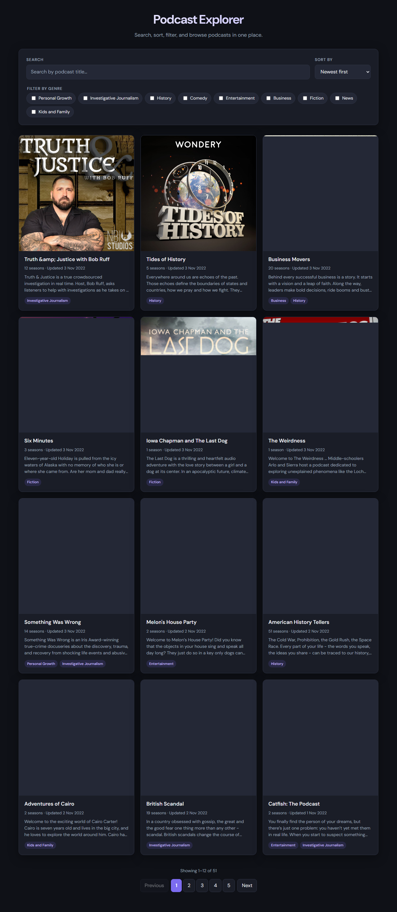

# DSJ04 React Podcast App

This is a solution to the **DSJ04 React Podcast App** coursework project — an advanced podcast browsing experience with search, sort, filter, and pagination. The app fetches data from the [Podcast API](https://podcast-api.netlify.app) and lets users explore shows with real-time, synchronised controls.

## Table of contents

- [Overview](#overview)
  - [The challenge](#the-challenge)
  - [Screenshot](#screenshot)
- [My process](#my-process)
  - [Built with](#built-with)
  - [What I learned](#what-i-learned)
  - [Continued development](#continued-development)
  - [Useful resources](#useful-resources)
  - [AI Collaboration](#ai-collaboration)
- [Author](#author)
- [Acknowledgments](#acknowledgments)

## Overview

### The challenge

Users should be able to:

- View a list of podcasts fetched from the remote API
- Search podcasts by title with results updating as they type
- Sort podcasts by newest first, title A–Z, or title Z–A
- Filter podcasts by one or more genres using a multi-select control
- Paginate through results without losing active search, sort, or filter state
- See a responsive layout that works across different screen sizes
- See hover and focus states on all interactive elements

### Screenshot



## My process

### Built with

- Semantic HTML5 markup
- CSS custom properties
- CSS Grid & Flexbox
- Mobile-first responsive workflow
- [React](https://reactjs.org/) — UI library
- [Vite](https://vitejs.dev/) — build tool and dev server
- React Context — centralised state management
- Plain CSS — no UI framework

### What I learned

This project reinforced how to keep multiple UI controls in sync without them fighting each other. The key was separating **data processing** (search → filter → sort → paginate) from **UI state** (what the user has selected).

The processing pipeline lives in pure utility functions, which makes it easy to test and reason about:

```js
export function processPodcasts(podcasts, { searchQuery, selectedGenres, sortBy }) {
  const searched = filterBySearch(podcasts, searchQuery);
  const filtered = filterByGenres(searched, selectedGenres);
  return sortPodcasts(filtered, sortBy);
}
```

Centralised state in React Context keeps every control reading from the same source of truth:

```jsx
const processedPodcasts = useMemo(
  () => processPodcasts(podcasts, { searchQuery, selectedGenres, sortBy }),
  [podcasts, searchQuery, selectedGenres, sortBy]
);
```

I also learned that search and filter changes should reset pagination to page 1, while page navigation should preserve all other selections — a small but important UX detail.

### Continued development

- Add URL query parameters so search, sort, filter, and page state can be shared via a link
- Write unit tests for the utility functions in `podcastUtils.js`
- Add a loading skeleton instead of plain text while podcasts fetch
- Consider debouncing the search input for larger datasets

### Useful resources

- [Podcast API](https://podcast-api.netlify.app) — source of all podcast preview data used in this project
- [React Context documentation](https://react.dev/reference/react/useContext) — helped with structuring centralised app state
- [Vite documentation](https://vitejs.dev/guide/) — setup, dev server, and production build
- [The Markdown Guide](https://www.markdownguide.org/) — formatting this README

## Author

- GitHub - [@Nthabi2905](https://github.com/yourusername)


## Acknowledgments

- Course materials and brief for the DSJ04 React Podcast App project
- [Podcast API](https://podcast-api.netlify.app) for providing the preview data
- Genre metadata supplied in the project `data.js` file
